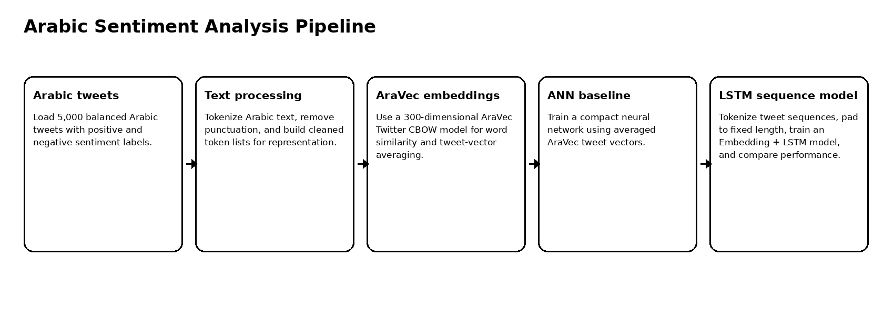
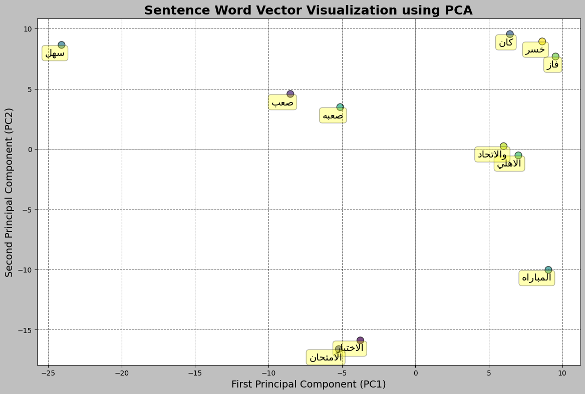
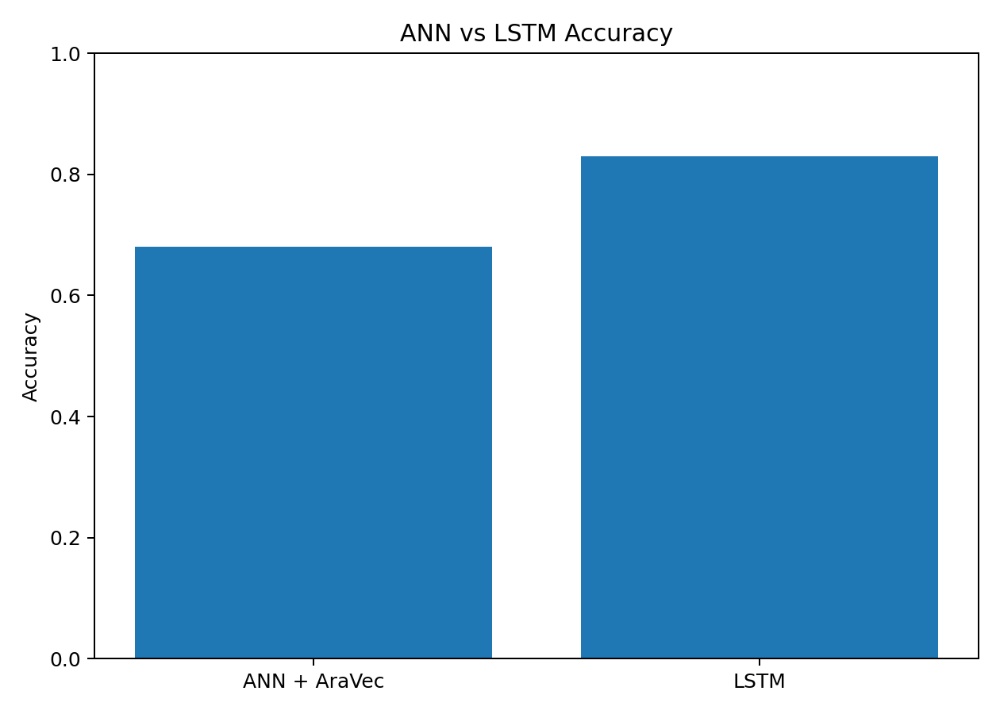

# Arabic Sentiment Analysis with AraVec, ANN, and LSTM

Arabic NLP project for tweet representation and sentiment classification using Bag of Words, AraVec word embeddings, ANN baseline modeling, and LSTM sequence learning.

## Overview

This project studies Arabic text representation and sentiment classification on a balanced Arabic tweet dataset. It combines classic representation methods, pretrained AraVec embeddings, semantic similarity analysis, embedding visualization, and neural classification models.

The project compares:

- ANN using averaged AraVec vectors,
- LSTM using learned sequence embeddings.

The LSTM model performed substantially better, reaching **83% accuracy**, compared with about **68% accuracy** for the ANN baseline.

## Dataset

| Item | Value |
|---|---:|
| Arabic tweets | 5,000 |
| Positive tweets | 2,500 |
| Negative tweets | 2,500 |
| Task | Binary Arabic sentiment classification |
| AraVec vector size | 300 |
| LSTM sequence length | 50 |
| Train/test split | 4,000 / 1,000 |

## Pipeline



## AraVec Representation

The notebook loads an AraVec Twitter CBOW embedding model and uses it to:

- represent Arabic words with 300-dimensional vectors,
- average word vectors into tweet-level representations,
- query semantically similar words,
- visualize selected words after PCA dimensionality reduction.



## Example Similarity Queries

| Query | Similar words observed |
|---|---|
| `امتحان` | الامتحان، ميدتيرم، امتحانين، اختبار، امتحانات |
| `الاهلي` | الزمالك، الاتحاد، للاهلي، الاسماعيلي، الهلال |

## Model Comparison

| Model | Representation | Accuracy | Negative F1 | Positive F1 |
|---|---|---:|---:|---:|
| ANN | Averaged AraVec vectors | 0.68 | 0.69 | 0.66 |
| LSTM | Learned embedding + sequence model | 0.83 | 0.84 | 0.81 |



## Key Findings

1. AraVec embeddings captured meaningful Arabic semantic relationships.
2. PCA visualization showed how related words can be inspected in a two-dimensional embedding projection.
3. ANN with averaged vectors lost word-order information and achieved moderate performance.
4. LSTM handled token sequences better and improved accuracy from about 68% to 83%.
5. Sequence-aware models are more suitable for sentiment analysis when word order and context affect meaning.

## Repository Structure

```text
.
├── arabic_sentiment_aravec_lstm.ipynb
├── src/
│   ├── preprocess_arabic.py
│   └── train_lstm.py
├── docs/
│   └── figures/
├── results/
│   ├── embedding_similarity_examples.json
│   └── model_comparison.csv
├── requirements.txt
├── .gitignore
└── README.md
```

## Run Locally

Create a clean Python environment and install the dependencies.

### Windows PowerShell

```powershell
py -3.10 -m venv .venv
.\.venv\Scripts\Activate.ps1
python -m pip install --upgrade pip
pip install -r requirements.txt
```

### Linux / macOS

```bash
python3 -m venv .venv
source .venv/bin/activate
python -m pip install --upgrade pip
pip install -r requirements.txt
```


## Dataset Setup

Place the Arabic sentiment dataset at:

```text
data/arabic_tweets.csv
```

Expected columns:

```text
sentiment,text
```

The AraVec model files are not included in the repository because they are large external artifacts.

## Open the Notebook

```bash
jupyter notebook arabic_sentiment_aravec_lstm.ipynb
```

## Optional Script Usage

```bash
python src/train_lstm.py --data data/arabic_tweets.csv --epochs 10
```

## Notes

This project assumes local access to the Arabic tweet dataset and, for the AraVec sections, a local AraVec embedding model.
